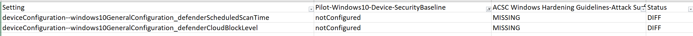
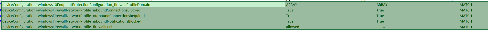
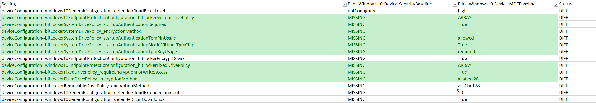

# Intune Baseline Policy Compare Tool
This tool helps admins to find the difference and conflict between two given Intune baseline policies. As a result, it will produce excel sheet with the difference, matching and conflict setting details.
It matches settings by **definitionId** property.

**Note**: This policy files have been generated using https://github.com/microsoftgraph/powershell-intune-samples

## Usage

    CompareIntuneBaselineCompare.exe "<file1>.json" "<file2>.json" "<outputpath>"

E.g. **CompareIntuneBaselineCompare.exe "C:\Intune\Pilot-Windows-10-Device-SecurityBaselineACSCWindowsHardening.json" "C:\Intune\Pilot-Windows10-Device-SecurityBaseline_01-11-2023-15-53-56.743.json" "C:\Intune\"**

## Meaning
**MATCH**: Both config file has exact match.

**CONFLICT**: Both config file has different value set.

**DIFF**: Either file has **MISSING** setting or **notConfigured**.

MISSING VIEW

NOT CONFIGURED VIEW

**ARRAY**: Given setting has nested child array, which gets flattern by its definitionId.

JSON VIEW

EXCEL VIEW

MORE EXAMPLE

**implementationId** Representation :

JSON VIEW:

EXCEL VIEW:

## Disclaimer

This tool has not been thoroughly tested and not responsible for any damage, if you find any bug, please log an issue.
